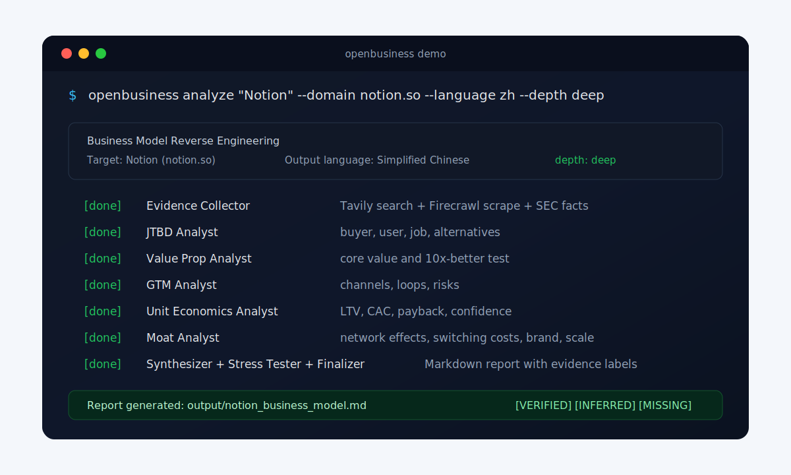
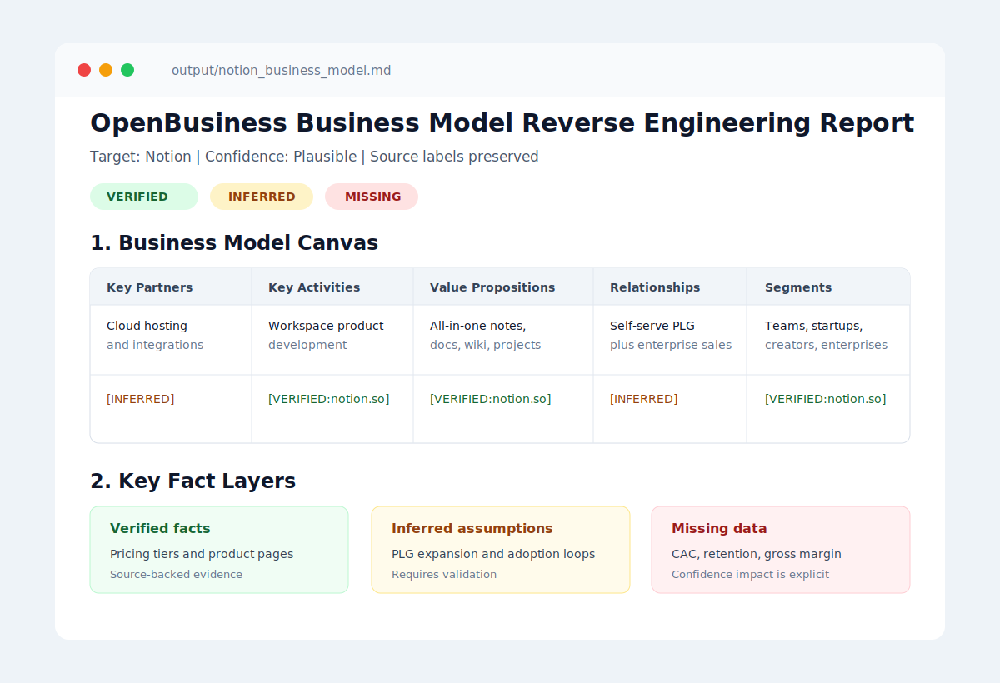

# OpenBusiness

> Business model research CLI that labels claims as verified, inferred, or
> missing.

[](https://pypi.org/project/openbusiness/)
[](https://www.python.org/)
[](https://www.langchain.com/langgraph)
[](#bilingual-output)
[](#license)

> **Install:** `pipx install openbusiness` &nbsp;·&nbsp; one-shot: `uvx openbusiness analyze "Notion" --domain notion.so`

OpenBusiness is an open-source Python CLI, published on PyPI as `openbusiness`
0.1.0, for business model research. It takes a company name, domain, and
optional stock ticker, collects public evidence, runs LangGraph analyst agents,
and produces a Markdown business model report. OpenBusiness differs from
generic LLM prompting by labeling every claim as verified, inferred, or missing
and by stress-testing the assumptions that would change the analysis. It is
built for founders, investors, consultants, product teams, and researchers who
need a first-pass company report before deeper diligence.

It is inspired by [TradingAgents](https://github.com/TauricResearch/TradingAgents),
but OpenBusiness is not a bull-vs-bear debate system. Business model analysis
needs decomposition, evidence tracking, and assumption pressure-testing, not a
buy/sell vote.





## Highlights

- Multi-agent business analysis pipeline built with LangGraph.
- Evidence collection through Tavily search, Firecrawl scraping, and SEC EDGAR.
- Business model canvas output with explicit evidence labels: verified, inferred,
  or missing.
- Domain analysis packs for SaaS, public companies, ecommerce, AI
  infrastructure, consumer apps, and general company research.
- Audience templates for standard analysis, investor memos, founder copycat
  studies, and competitor maps.
- Reproducible run artifacts with stage outputs, source extraction, and run
  metadata.
- Bilingual report generation with `--language en` and `--language zh`.
- Provider support for OpenAI, Anthropic, and DeepSeek.
- Local config wizard with hidden API-key input and `0600` config permissions.
- Language-purity warnings when generated reports mix output languages.
- Pure Markdown reports that can be archived, edited, or shared directly.

## Use Cases

OpenBusiness is useful when you need a structured first-pass business model
research report before deeper diligence:

| Audience | Common question | OpenBusiness output |
| --- | --- | --- |
| Founders | What can I copy, avoid, or attack in this market? | GTM motion, value proposition, moat, and fatal weakness. |
| Investors | Is the company durable, fragile, or speculative? | Evidence-labeled thesis, claims, and stress test. |
| Consultants | How does this company actually make money? | Business model canvas, profit engine, and unit economics. |
| Product teams | Why do customers switch and stay? | JTBD, adoption friction, switching triggers, and alternatives. |
| Researchers | What data is missing before making a stronger claim? | Missing-data inventory and validation plan. |

Search keywords: business model research CLI, business model canvas generator,
company research tool, competitive analysis, unit economics, LangGraph agents,
evidence-labeled reports.

## Business Model Research Tool Comparison

| Approach | Evidence source | Output format | Time per report | Cost per report | Evidence labeling | Stress test |
| --- | --- | --- | --- | --- | --- | --- |
| OpenBusiness | Web evidence, SEC EDGAR for public companies, and configured evidence APIs | Markdown business model report with run artifacts | 2-4 minutes per report | Reports cost about $0.10-$0.40 in API calls, depending on provider and evidence pack size | Yes | Yes |
| Manual research (3-day analyst) | Analyst web research, interviews, filings, and paid databases | Slides, memo, spreadsheet, or custom document | About 3 working days | Analyst time plus any paid data sources | Partial | Partial |
| Generic ChatGPT prompt | User-provided context and model training data | Chat response or copied document | Minutes | Chat subscription or API usage | No | Partial |
| Other automated business analysis tools (generic) | Usually web search plus model training data | Web app report or PDF | Minutes | Subscription or per-report fee | Partial | Partial |

## What It Produces

OpenBusiness writes a final Markdown report with this shape:

```markdown
# OpenBusiness Business Model Reverse Engineering Report

**Target:** Notion | **Confidence:** Plausible

## 1. Business Model Canvas

| Key Partners | Key Activities | Value Propositions | Customer Relationships | Customer Segments |
| --- | --- | --- | --- | --- |
| Stripe, AWS, app ecosystem [INFERRED] | Product development, collaboration workflows [VERIFIED:notion.so] | All-in-one workspace [VERIFIED:notion.so] | Self-serve PLG plus enterprise support [INFERRED] | Teams, startups, creators, enterprises [VERIFIED:notion.so] |

## 2. Key Claim Layers

### Verified Claims

- Pricing includes Free, Plus, Business, and Enterprise tiers. [VERIFIED:notion.so/pricing]

### Inferred Claims

- Expansion likely depends on team-level workspace adoption. [INFERRED]

### Missing Claims

- Actual CAC, gross margin, and cohort retention are not publicly disclosed. [MISSING]

## 3. Assumption Stress Test

## 4. Next Steps
```

## Evidence Discipline

The central product principle is simple: know what is known, infer only when the
evidence supports it, and mark the unknown instead of hiding it.

Evidence labels are intentionally visible and treated as part of the claim
contract:

| Label | Meaning |
| --- | --- |
| `[VERIFIED:url]` | The claim is supported by a source. |
| `[INFERRED]` | The claim is a reasoned inference from available context. |
| `[MISSING]` | The missing data materially affects confidence. |

These labels are part of the claim contract. OpenBusiness keeps them through
collection, analysis, synthesis, stress testing, and finalization. Analysis
packs and report templates can change the lens of the analysis, but they must
not remove or soften the evidence labels.

## Quick Start

### 1. Clone

```bash
git clone https://github.com/wanikua/OpenBusiness.git
cd OpenBusiness
```

### 2. Install

```bash
./install.sh
```

The installer asks you to choose English or Chinese first, checks Python,
creates a virtual environment if needed, installs the package in editable mode,
and starts the configuration wizard in the selected language. That first
language choice becomes the default terminal UI language and the default report
language for `openbusiness analyze`, unless you explicitly override the report
language later.

If you accept the default `.venv` setup, the installer activates it for the
installation session. In every new terminal, activate it again before running
`openbusiness`:

```bash
source .venv/bin/activate
```

If you declined virtual environment creation, skip this activation step and use
the Python environment where you installed the package.

### 3. Configure Or Reconfigure

```bash
openbusiness config
```

The installer normally starts this wizard automatically. Run it manually when
you skipped the wizard, changed terminals before completing setup, or need to
update keys later.

The setup stores:

| Setting | Required | Notes |
| --- | --- | --- |
| Interface language | Yes | Set by the installer or `openbusiness config --ui-language en`. |
| LLM provider | Yes | `openai`, `anthropic`, or `deepseek` |
| Report language | Yes | Defaults to the interface language; can be changed with `--language`. |
| Provider API key | Yes | OpenAI, Anthropic, or DeepSeek key |
| Tavily API key | No | Enables live search evidence |
| Firecrawl API key | No | Enables page scraping evidence |

Config is saved to `~/.config/openbusiness/config.toml`.

### 4. Run

```bash
source .venv/bin/activate
openbusiness analyze "Notion" --domain notion.so --language en
```

If your shell prompt already shows the virtual environment is active, you do not
need to run `source .venv/bin/activate` again in the same terminal.

The report is written to `output/notion_business_model.md`.

## CLI

```bash
source .venv/bin/activate

openbusiness config
openbusiness config --reset
openbusiness config --language en
openbusiness config --ui-language en
openbusiness show
openbusiness packs
openbusiness templates

openbusiness analyze "Notion" --domain notion.so
openbusiness analyze "Costco" --ticker COST
openbusiness analyze "Vercel" --domain vercel.com --output reports/
openbusiness analyze "Notion" --domain notion.so --language en
openbusiness analyze "Notion" --domain notion.so --language zh
openbusiness analyze "Notion" --domain notion.so --ui-language en --language zh
openbusiness analyze "Notion" --domain notion.so --depth deep
openbusiness analyze "Vercel" --domain vercel.com --pack saas --template investor-memo
```

Analysis options:

| Option | Description |
| --- | --- |
| `--domain`, `-d` | Official company domain for evidence gathering. |
| `--ticker`, `-t` | Public-company ticker for SEC EDGAR lookup. |
| `--output`, `-o` | Output directory. Defaults to `output/`. |
| `--language`, `-l` | Report language for this run. Supports `en` and `zh`. |
| `--ui-language` | Terminal interface language for this run. If `--language` is omitted, the report follows the resolved interface language by default. |
| `--depth` | Research depth. Use `standard` for faster runs or `deep` for broader evidence collection. |
| `--pack` | Built-in analysis pack id. Run `openbusiness packs` to list options. |
| `--pack-file` | Custom analysis pack TOML file. |
| `--template` | Built-in report template id. Run `openbusiness templates` to list options. |
| `--template-file` | Custom report template Markdown file with TOML front matter. |

`openbusiness analyze` does not ask for language choices at startup. The
terminal UI language comes from install/config, and the report language follows
that UI language unless you explicitly set `--language`, `OPENBUSINESS_OUTPUT_LANGUAGE`,
or `openbusiness config --language`.

## Environment Variables

Environment variables override local config. They are useful for CI, containers,
and temporary provider switches.

```bash
export OPENBUSINESS_PROVIDER=deepseek
export OPENBUSINESS_UI_LANGUAGE=en
export OPENBUSINESS_OUTPUT_LANGUAGE=en
export DEEPSEEK_API_KEY=sk-xxx
export DEEPSEEK_BASE_URL=https://api.deepseek.com
export DEEPSEEK_TIMEOUT=60
export DEEPSEEK_MAX_RETRIES=1
export DEEPSEEK_MAX_TOKENS=2048
export TAVILY_API_KEY=tvly-xxx
export FIRECRAWL_API_KEY=fc-xxx

openbusiness analyze "Notion" --domain notion.so
```

Interface language precedence:

1. `openbusiness analyze --ui-language en`
2. `OPENBUSINESS_UI_LANGUAGE=en`
3. `ui_language = "en"` in local config
4. Default: `zh`

Report language precedence:

1. `openbusiness analyze --language en`
2. `OPENBUSINESS_OUTPUT_LANGUAGE=en`
3. `output_language = "en"` in local config
4. Resolved interface language

## Analysis Packs And Templates

Analysis packs make the pipeline more domain-aware without hard-coding every
company into one generic prompt. Built-in packs include:

| Pack | Use it for |
| --- | --- |
| `general` | Default company research when the model is unclear or mixed. |
| `saas` | Subscription software, PLG, sales-led SaaS, and B2B software. |
| `public-company` | Listed companies where filings, segments, and margins matter. |
| `ecommerce` | DTC, marketplace, retail commerce, and product businesses. |
| `ai-infra` | Developer tools, model platforms, data tooling, and AI infrastructure. |
| `consumer-app` | Consumer, prosumer, creator, media, and community products. |

Report templates change the reader lens:

| Template | Use it for |
| --- | --- |
| `standard` | General OpenBusiness report. |
| `investor-memo` | First-pass diligence, business quality, and downside risk. |
| `founder-copycat` | What to copy, avoid, attack, or validate as a new entrant. |
| `competitor-map` | Alternatives, likely competitive response, and positioning. |

Examples:

```bash
openbusiness packs
openbusiness templates
openbusiness analyze "Vercel" --domain vercel.com --pack saas --template investor-memo
openbusiness analyze "Costco" --ticker COST --pack public-company
```

Custom packs are TOML files with `id`, `name`, `description`,
`evidence_focus`, and `analyst_focus`. Custom templates are Markdown files with
TOML front matter. Both are prompt guidance only: they cannot bypass evidence
labels or turn missing data into verified claims.

## Run Artifacts

Each run keeps the existing portable report path:

```text
output/<company>_business_model.md
```

It also writes a reproducible artifact folder:

```text
output/<company>/
├── report.<language>.md
├── run.json
├── evidence.json
├── sources.md
└── stages/
    ├── 01_evidence.md
    ├── 02_jtbd.md
    ├── 03_value_prop.md
    ├── 04_gtm.md
    ├── 05_unit_econ.md
    ├── 06_moat.md
    ├── 07_canvas.md
    ├── 08_stress_test.md
    └── 09_final.md
```

This makes reports easier to debug, compare, and improve. If a conclusion feels
too shallow, inspect the stage files to see whether the weakness came from
missing evidence, weak inference, or final-report compression.

## Bilingual Output

OpenBusiness supports English and Simplified Chinese report generation:

```bash
openbusiness analyze "Notion" --domain notion.so --language en
openbusiness analyze "Notion" --domain notion.so --language zh
openbusiness analyze "Notion" --domain notion.so --ui-language en --language zh
```

Without `--language`, the report follows the terminal UI language selected
during installation or configuration. Use `--language` when you want the UI and
report languages to be different.

The language contract is applied to every analyst node. Final reports also run
a language-purity check:

- English reports warn if generated content contains Chinese characters.
- `zh` reports warn if generated content contains English section headings or
  English-like prose lines.
- Company names, URLs, tickers, metric abbreviations, API/tool names, model
  names, and evidence tags are preserved intentionally.

## Depth Mode

Use `--depth deep` when you want a more serious research pass:

```bash
openbusiness analyze "Notion" --domain notion.so --language zh --depth deep
```

`standard` keeps evidence collection bounded for faster runs. `deep` lets the
evidence collector spend more tool rounds and use broader search depth for
customer proof, hiring signals, ecosystem clues, competitor positioning, and
negative evidence. All analyst nodes still use the same depth standard: major
conclusions must include mechanism, evidence quality, countercase, business
implication, and validation data.

## Pipeline

```text
Company name + optional domain + optional ticker
  |
  v
Evidence Collector
  |-- Tavily search
  |-- Firecrawl scrape
  |-- SEC EDGAR company data
  v
JTBD Analyst
  v
Value Proposition Analyst
  v
GTM Analyst
  v
Unit Economics Analyst
  v
Moat Analyst
  v
Business Model Synthesizer
  v
Assumption Stress Tester
  v
Finalizer
  v
output/<company>_business_model.md
output/<company>/run.json + stage artifacts
```

Core design principles:

- Evidence first: source material is collected before analysis.
- Claims stay tagged: verified, inferred, and missing claims are
  never flattened into one confidence level.
- Tools do deterministic work: unit-economics calculations run in Python, not
  inside model prose.
- The final output is portable Markdown.
- Analysis packs and templates can change the lens, but the evidence-label
  contract stays fixed.

## Providers

| Provider | Config key | Notes |
| --- | --- | --- |
| OpenAI | `OPENAI_API_KEY` | Default provider. |
| Anthropic | `ANTHROPIC_API_KEY` | Supported through LangChain Anthropic. |
| DeepSeek | `DEEPSEEK_API_KEY` | Uses an OpenAI-compatible endpoint. |

Optional evidence APIs:

| Service | Config key | Purpose |
| --- | --- | --- |
| Tavily | `TAVILY_API_KEY` | Web search evidence. |
| Firecrawl | `FIRECRAWL_API_KEY` | Website and page scraping. |

If Tavily or Firecrawl is not configured, the pipeline still runs, but more
claims will be marked `[INFERRED]` or `[MISSING]`.

## Project Structure

```text
OpenBusiness/
├── install.sh
├── pyproject.toml
├── README.md
├── LICENSE
├── CONTRIBUTING.md
├── llms.txt
├── .env.example
├── docs/
│   ├── PROMOTION.md
│   ├── EXTENDING.md
│   └── assets/
│       ├── openbusiness-terminal-demo.svg
│       └── openbusiness-report-preview.svg
├── .github/
│   └── workflows/
│       └── ci.yml
└── openbusiness/
    ├── cli.py
    ├── language.py
    ├── profiles.py
    ├── resources/
    │   ├── packs/
    │   └── templates/
    ├── agents/
    │   ├── analysts/
    │   └── utils/
    ├── graph/
    ├── llm_clients/
    └── tools/
```

## Development

```bash
python -m pip install -e ".[dev]"
python -m ruff check openbusiness
python -m compileall openbusiness
bash -n install.sh
python -m openbusiness.cli packs
python -m openbusiness.cli templates
```

Supply-chain and release hygiene:

- CI installs from the checked-out package and runs lint, compile, installer
  syntax, resource smoke tests, and the README English-only check.
- Runtime resources are packaged through `pyproject.toml` package data instead
  of fetched dynamically at install time.
- Generated output, local config, API keys, and virtual environments must stay
  out of commits.
- README and top-level metadata stay English-only for GitHub and package-index
  readability.

## Community

OpenBusiness is meant to be co-built with people who care about better business
research. The goal is a shared open-source workflow for evidence-labeled
company analysis.

- Star the repository if OpenBusiness helps your research workflow.
- Open an issue for bugs, missing providers, report-quality problems, or
  company-analysis examples that expose weak reasoning.
- Share real analysis examples that show where the pipeline is shallow, slow, or
  missing important evidence.
- Contribute domain packs, report templates, evidence connectors, or better
  stage prompts when you can show how they improve evidence quality or reasoning
  depth.
- Read [CONTRIBUTING.md](CONTRIBUTING.md) before sending a pull request.
- Use [docs/EXTENDING.md](docs/EXTENDING.md) when adding analysis packs, report
  templates, or evidence tools.
- Use [docs/PROMOTION.md](docs/PROMOTION.md) for launch copy, GitHub topic
  suggestions, and community posting templates.
- `llms.txt` is available for AI assistants, answer engines, and developer
  tools that need a compact project summary.

## Frequently Asked Questions About OpenBusiness

### What is OpenBusiness?

OpenBusiness is an open-source Python CLI for business model research. It takes
a company name, domain, and optional stock ticker, collects public evidence,
runs LangGraph analyst agents, and writes a Markdown business model report with
each claim labeled as verified, inferred, or missing.

### How is OpenBusiness different from generic LLM business analysis?

Generic LLM prompting often blends sourced claims, inferred claims, and missing
data into one confident answer. OpenBusiness keeps those claim types visible in
the report. It also runs a fixed analyst pipeline, keeps run artifacts, performs
unit-economics calculations in Python, and includes an assumption stress test.

### Can OpenBusiness analyze private companies?

Yes, but private-company reports usually contain more inferred and missing
claims because private companies do not publish full financials, churn, CAC,
ARPU, or cohort data. OpenBusiness is designed to show those gaps instead of
filling them with invented numbers.

### How much does OpenBusiness cost to run?

Reports cost about $0.10-$0.40 in API calls, depending on provider and evidence
pack size. The package is open source under the MIT License, and you bring your
own OpenAI, Anthropic, DeepSeek, Tavily, and Firecrawl keys.

### Which LLM providers does OpenBusiness support?

OpenBusiness supports OpenAI, Anthropic, and DeepSeek. The provider is selected
through local config or environment variables. Tavily and Firecrawl are optional
evidence APIs; without them, more report claims are likely to be inferred or
missing.

### What is the assumption stress test?

The assumption stress test identifies the assumptions that would most change the
business model report if they were wrong. For example, it can show how a churn,
ARPU, CAC, gross-margin, or revenue-mix assumption changes LTV/CAC and the
overall business model judgment.

### What does OpenBusiness output?

OpenBusiness writes a Markdown report and a reproducible artifact folder. The
report includes a business model canvas, claim layers, unit economics, moat
analysis, assumption stress test, and next steps. The artifact folder includes
run metadata, evidence, sources, and stage outputs.

## Troubleshooting

### `./install.sh: Permission denied`

```bash
chmod +x install.sh
./install.sh
```

### `openbusiness: command not found`

Activate the virtual environment used during installation:

```bash
source .venv/bin/activate
```

### The report is mostly inferred

Configure Tavily and Firecrawl so the evidence collector can gather live source
material:

```bash
openbusiness config --reset
```

### The report language is mixed

Run with an explicit language override:

```bash
openbusiness analyze "Notion" --domain notion.so --language en
openbusiness analyze "Notion" --domain notion.so --language zh
```

If the warning persists, retry with a model that follows formatting and
language constraints more strictly.

## License

OpenBusiness is released under the MIT License. See [LICENSE](LICENSE) for the
full license text.
