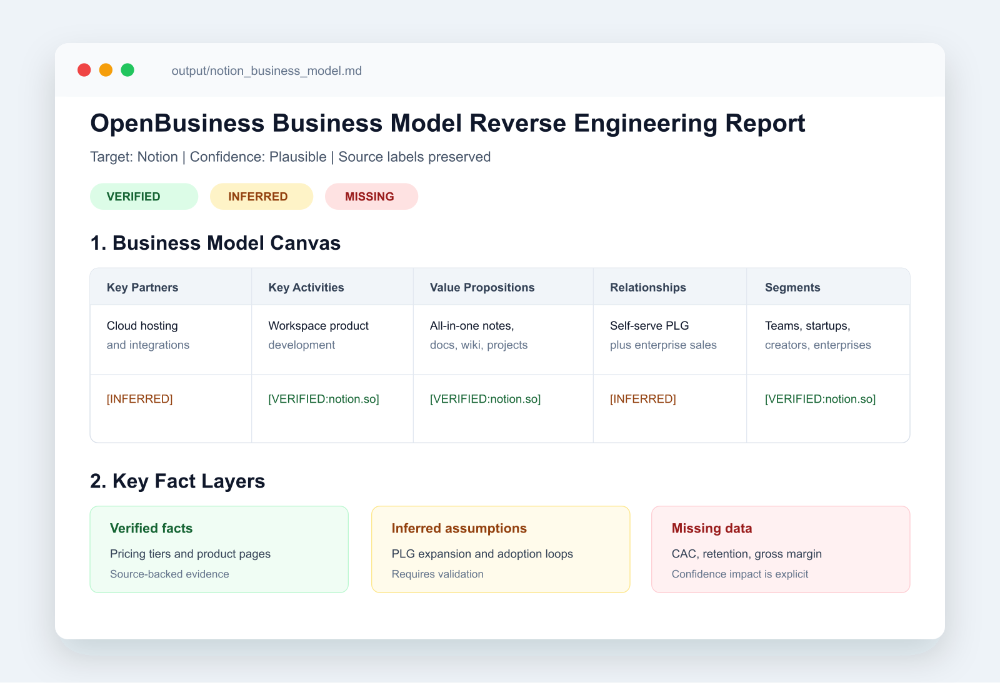
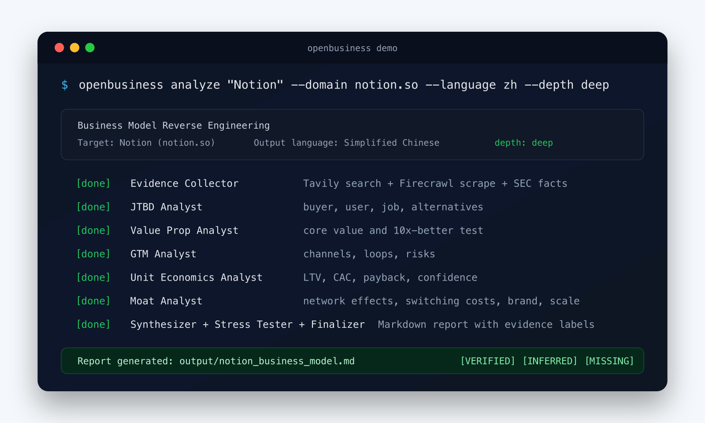

# Ready to Post — copy/paste packet

Everything below is finalized. For each platform: copy the text in the code
block, then upload the marked image in the platform's composer. **Text
platforms (X, Reddit, HN) cannot embed an image from pasted text — you upload it
in the UI.** Images are PNG (X/Reddit/PH accept PNG; HN allows none).

Image files (already rendered, 1600px):
- `promo/images/report-preview.png` — the report mockup (verified/inferred/missing tags)
- `promo/images/terminal-demo.png` — the 9-agent pipeline running




---

## 1. X / Twitter — 9-tweet thread

**How to post:** In the X composer, type tweet 1, click the **＋** (bottom-left)
to add the next tweet, repeat through 9, then **Post all**. Attach
`report-preview.png` to **tweet 2** and `terminal-demo.png` to **tweet 5**
(click the image icon on that tweet's box). Or use Typefully / Buffer to
schedule the whole thread at once. Each tweet is already under 280 chars.

**Tweet 1**
```
I ran OpenBusiness on Notion.

It modeled LTV/CAC at 1.6x — below the healthy 3x benchmark.

Then it showed the dangerous part:

6% monthly churn → 1.07x
2% monthly churn → 3.2x

Same company, different churn assumption, totally different story.

🧵 ↓
```

**Tweet 2**  ⬆️ **upload `report-preview.png` here**
```
OpenBusiness is a free, open-source CLI that turns public evidence into a first-pass business model report.

Every claim is tagged:

🟢 verified  ·  🟡 inferred  ·  🔴 missing

It separates facts from guesses.
```

**Tweet 3**
```
Input: a company name + domain.

Output: business model canvas, unit economics, moat analysis, and an assumption stress test.

Notion example:

LTV/CAC = 1.6x

⚠️ Below the healthy 3x benchmark.
```

**Tweet 4**
```
"If actual monthly churn is 6% instead of 4%, LTV drops to $160, LTV/CAC → 1.07x. Unsustainable."

"If churn is 2%, LTV jumps to $480, LTV/CAC → 3.2x. Healthy."

That churn estimate is the assumption that changes the whole report.
```

**Tweet 5**  ⬆️ **upload `terminal-demo.png` here**
```
9-agent linear pipeline. No bull/bear debate.

🔍 Evidence Collector (Tavily + Firecrawl + SEC EDGAR)
👥 JTBD → 💎 Value Prop → 🚀 GTM
💰 Unit Econ (pure Python math, not LLM)
🛡️ Moat → 🧱 Canvas → 🔬 Stress Test → 📝 Final

Business analysis is decomposition, not a vote.
```

**Tweet 6**
```
Design choices that matter:

• Evidence pulled before analysts run
• Unit economics is a Python function
• Two LLM tiers: mini/haiku for analysts, stronger model for synthesis
• Provider support: OpenAI, Anthropic, DeepSeek
• Each claim tagged
```

**Tweet 7**
```
Honest about what it can't do:

It won't get you verified ARPU when a private company doesn't publish it.

It marks that 🔴 missing instead of inventing a number.

That's the point.
```

**Tweet 8**
```
Install:

pipx install openbusiness
openbusiness config
openbusiness analyze "Notion" --domain notion.so

Bring your own OpenAI, Anthropic, or DeepSeek key. Tavily + Firecrawl are optional (you get more 🟡 without them).
```

**Tweet 9**
```
The full Notion sample report is in the repo (examples/).

Clone, run a first-pass report from public evidence, and tell me which assumption changed the story.

→ https://github.com/wanikua/OpenBusiness

⭐ if useful.
```

---

## 2. Reddit — r/SideProject

Reddit supports markdown. Post as a **text post**. To add the image: in the
post editor click the image icon and upload `report-preview.png` (or drop it as
the first comment).

**Title** (copy):
```
Built a CLI that showed Notion at 1.6x LTV/CAC, then stress-tested the churn assumption
```

**Body** ⬆️ **upload `report-preview.png` in the post**:
```
The sample that finally made the project click was Notion.

OpenBusiness modeled LTV/CAC at **1.6x** — below the healthy 3x benchmark. Then the stress tester changed one assumption:

> *"If actual monthly churn is 6% instead of the inferred 4%, LTV/CAC → 1.07x, unsustainable. If churn is 2%, LTV/CAC → 3.2x, healthy."*

That is the output I wanted: not a polished company summary, but a report that shows which assumption can flip the conclusion.

**OpenBusiness** takes a company name and domain, gathers public evidence, and produces a business model canvas where each line is tagged:

- 🟢 `[VERIFIED:url]` — sourced from evidence
- 🟡 `[INFERRED]` — model guess from context
- 🔴 `[MISSING]` — couldn't verify, flagged anyway

It's a 9-agent linear pipeline: evidence collector → JTBD → value prop → GTM → unit economics → moat → canvas synthesizer → assumption stress tester → finalizer. Built on LangGraph with OpenAI, Anthropic, and DeepSeek support.

**The design decision I had to make early:** the obvious inspiration was [TradingAgents](https://github.com/TauricResearch/TradingAgents), which uses a bull/bear debate to produce a buy/sell vote. I almost copied that structure. Then I realized business model analysis isn't a vote — it's a structured decomposition. Debate is the wrong primitive when there's no decision to make. So I went linear and used a stress tester instead of a debate to surface fragile assumptions.

**What's working:**

- The 🟢/🟡/🔴 tag convention. Models follow it much better when the prompt includes mixed examples.
- Unit economics done in Python, not LLM. The analyst populates inputs with tags and a `financial_tools.py` function (`calculate_unit_economics`) does the math.
- Two-tier model routing — mini/haiku for analysts, stronger model for the synthesizer. Cost dropped to ~$0.10–$0.40/report.

**What's not working yet:**

- Comparison mode. I want `openbusiness compare Notion Coda` to produce a side-by-side, but the prompt for "what's different in a meaningful way" is still bad.
- HTML report with collapsible evidence trails. Markdown is fine but the evidence trail bloats the report.
- Private companies still produce thin reports. Without SEC filings, you're stuck inferring most of the unit economics.

Repo (MIT, full Notion sample report in `examples/`): https://github.com/wanikua/OpenBusiness

Install:
pipx install openbusiness
openbusiness config
openbusiness analyze "Notion" --domain notion.so

Bring your own LLM key. Tavily and Firecrawl are optional but the report gets more 🟡 without them.

Happy to talk through the prompts, the LangGraph wiring, or the two-tier cost work if anyone's building something similar.
```

---

## 3. Reddit — r/Entrepreneur

**Title** (copy):
```
Notion looked like 1.6x LTV/CAC — then one churn assumption changed the whole model
```

**Body** ⬆️ **upload `report-preview.png` in the post**:
```
I ran a first-pass report on Notion and got the kind of answer I wish more founder decks admitted.

Modeled LTV/CAC: **1.6x** — below the healthy 3x benchmark. The stress test then showed why the conclusion was fragile:

> *"If actual monthly churn is 6% instead of the inferred 4%, LTV drops to $160, LTV/CAC → 1.07x — unsustainable. If churn is 2% (content lock-in works), LTV/CAC → 3.2x — healthy."*

That is the real question: not "what is the number?" but "which assumption changes the story?"

So I built **OpenBusiness**, an open-source CLI that creates a business model report from public evidence and tags each claim:

- 🟢 verified (sourced, citable)
- 🟡 inferred (model guess from context)
- 🔴 missing (couldn't verify — flagged, not hidden)

You point it at a company name + domain. It pulls evidence (Tavily search, Firecrawl scrape, SEC EDGAR for public companies), runs 9 analyst agents (JTBD, value prop, GTM, unit economics, moat, etc.), then synthesizes a business model canvas with evidence labels.

**The part most people find useful is the Assumption Stress Tester.**

It ranks the assumptions by how much the report changes when each one is wrong. In the Notion sample, churn, ARPU, and CAC matter far more than the rest of the narrative. That's what investors should ask about, and what founders should know before they put numbers in a deck.

**Why it matters for founders:**

1. **Run it on your own company.** It separates what is verified from what is assumed in your model. Better to find the weak assumptions before a board call.
2. **Run it on competitors.** You get a structured first-pass report without spending 8 hours gathering notes.
3. **Run it before a fundraise.** The stress tester output gives you the questions a sharp investor is likely to ask.

**What it isn't:**

- Not a market research tool. It analyzes business *models*, not market sizes.
- Not a fortune teller for private-company financials. If actual ARPU isn't public, it'll mark it 🔴 instead of inventing a number.
- Reports cost $0.10–$0.40 in API calls and take 2–4 minutes.

Bring your own OpenAI, Anthropic, or DeepSeek key. Tavily + Firecrawl are optional but recommended (both free tiers are enough).

pipx install openbusiness
openbusiness config
openbusiness analyze "Notion" --domain notion.so

MIT licensed. The full Notion sample report is in `examples/` if you want to read it before installing.

→ https://github.com/wanikua/OpenBusiness

Curious what you'd run it on — and which assumption changes the report.
```

---

## 4. Reddit — r/LocalLLaMA

This one leads with the model-behavior angle (the right hook for that sub). The
full body is long — post the body of `promo/reddit-localllama.md` verbatim.
Title:
```
Long synthesis outputs kept dropping evidence tags after ~1.5–2k tokens on Llama 3.1 70B
```
Optional image: `report-preview.png`. r/LocalLLaMA is text-first; the image is
not required there.

---

## 5. Hacker News — Show HN

HN renders **no markdown and no images** in the text box. Paste the plain text
below. Put the repo URL in the **URL field**, not the text.

**Title field:**
```
Show HN: OpenBusiness – Notion LTV/CAC was 1.6x until churn changed
```

**URL field:**
```
https://github.com/wanikua/OpenBusiness
```

**Text field** (plain — no markdown):
```
I ran OpenBusiness on Notion and the useful part was not the canvas. It was the stress test: modeled LTV/CAC came out to 1.6x, below the healthy 3x benchmark. If inferred monthly churn moves from 4% to 6%, LTV drops to $160 and LTV/CAC falls to 1.07x. If churn is 2%, LTV jumps to $480 and LTV/CAC reaches 3.2x.

That is the problem I wanted the tool to expose: which assumption changes the conclusion?

OpenBusiness is an open-source CLI that builds a first-pass business model report from public evidence. It tags claims as verified (sourced from evidence: Tavily search, Firecrawl scrape, SEC EDGAR), inferred (model inference from context), or missing (data could not be verified and affects confidence).

Pipeline is 9 agents in a linear flow (LangGraph). Inspired by TradingAgents, but I deliberately did not copy the bull/bear debate. Business model output is a decomposition, not a buy/sell vote.

Two implementation details that took longest to get right:
1. Unit economics is a Python function, not an LLM call. The analyst populates inputs with tags, then the math runs.
2. Two-tier model routing: mini/haiku for the analysts, a stronger model for the synthesizer and stress tester. Full reports cost about $0.10 to $0.40 depending on provider.

Providers: OpenAI, Anthropic, and DeepSeek. Tavily and Firecrawl are optional, but without live retrieval the report depends more on inference and should be treated as weaker.

Limitations: it cannot verify private-company financials when the company does not publish them, so private companies get more inferred/missing tags. Reports take 2 to 4 minutes. Quality depends heavily on the evidence available.

The full Notion sample report is in examples/ if you want to read before installing.

  pipx install openbusiness && openbusiness config

MIT. Feedback welcome — especially: which agent's prompt would you rewrite first?
```

> HN note: I stripped the 🟢/🟡/🔴 emoji and `code` backticks because HN shows
> them literally and the crowd is allergic to emoji. The repo link is the URL
> field, so don't repeat it in the text.

---

## 6. Product Hunt

PH supports a gallery — upload both PNGs as gallery shots (report first).

**Tagline (≤60):**
```
Notion's LTV/CAC was 1.6x. Stress-test the model.
```

**Description (≤260):**
```
Notion modeled at 1.6x LTV/CAC; 6% churn pushed it to 1.07x, while 2% churn reached 3.2x. OpenBusiness turns public evidence into a first-pass business model report, tags claims 🟢/🟡/🔴, and stress-tests assumptions.
```

**First comment (maker intro):**
```
Maker here 👋

I built OpenBusiness because I kept seeing business model reports where the cleanest-looking number was usually the least trustworthy one.

The example that made the tool feel useful was Notion. The report modeled LTV/CAC at 1.6x, below the healthy 3x benchmark. Then the stress tester showed the fragile part: if monthly churn is 6% instead of the inferred 4%, LTV/CAC falls to 1.07x. If churn is 2%, it reaches 3.2x.

That is what I wanted from the tool: not just "here is a canvas," but "here is the assumption that changes the conclusion."

OpenBusiness is a 9-agent CLI that gathers public evidence, builds a business model canvas, runs unit economics in Python, and tags claims as 🟢 verified, 🟡 inferred, or 🔴 missing. It supports OpenAI, Anthropic, and DeepSeek.

Free, MIT, full Notion sample report in the repo (examples/). I would especially value feedback on where the report still over-infers from thin evidence.
```

**Gallery:** shot 1 = `report-preview.png`, shot 2 = `terminal-demo.png`.
Full shot list and captions are in `promo/product-hunt.md`.

---

## Posting order (suggested)

1. **Show HN** (weekday, ~08:00–10:00 PT) — highest-signal, do it first and tend the comments.
2. **X thread** same morning; link the HN post in a reply.
3. **r/SideProject** + **r/LocalLLaMA** (don't cross-post identical text; each has its own angle above).
4. **r/Entrepreneur** a day later.
5. **Product Hunt** on its own day (Tue/Wed 00:01 PT); cross-post the X thread with the PH link.

Spacing them out avoids the spam pattern that gets posts removed.
